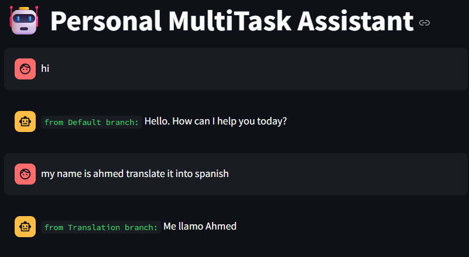

# Personal MultiTask Assistant

This project is a Streamlit-based AI assistant that can classify and handle multiple types of user input intelligently using LangChain and LLaMA3 (via Groq API). It can:

- Translate text into a target language.
- Summarize long text content.
- Answer general questions.

Each response clearly indicates which task branch was used, making the assistant transparent and user-friendly.

---

## Features

- **Intent Classification**: Classifies user input as translation, summarization, or general question.
- **Branch Routing**: Based on classification, routes the prompt to the appropriate chain.
- **Contextual Feedback**: Displays the name of the executed branch in the assistant's reply.
- **Streamlit Chat Interface**: Interactive and responsive UI.

---

## Preview

Below is an example of how the assistant visually communicates the result source:



---

## Project Structure

```

├── app.py              # Main Streamlit app
├── utils.py            # Chains, prompts, and branching logic
├── .env                # Contains API key(s)
├── Screenshot.png      # Sample output screenshot
└── README.md

````

---

## Prerequisites

- Python 3.9 or later
- An API key from [Groq](https://console.groq.com/)
- Git (optional, for cloning)

---

## Installation Guide

### 1. Clone the Repository

```bash
git clone https://github.com/your-username/personal-multitask-assistant.git
cd personal-multitask-assistant
````

### 2. Create a Virtual Environment

It’s recommended to use a virtual environment to manage dependencies:

```bash
python -m venv venv
```

Activate the environment:

* On Windows:

  ```bash
  venv\Scripts\activate
  ```

* On macOS/Linux:

  ```bash
  source venv/bin/activate
  ```

### 3. Install Requirements

```bash
pip install -r requirements.txt
```

If you don't have `requirements.txt`, here's a list of packages to install:

```bash
pip install streamlit python-dotenv langchain langchain-groq
```

---

## 4. Add Your `.env` File

Create a `.env` file in the root directory and add your Groq API key:

```
GROQ_API_KEY=your_groq_api_key_here
```

---

## 5. Run the App

Start the Streamlit app:

```bash
streamlit run app.py
```

It will open a browser tab where you can chat with the assistant.

---

## How It Works

### Step 1: Intent Classification

The input is classified using an LLM prompt into one of:

* `translation`
* `summarization`
* `general`

### Step 2: Merge Input

The input and its classification are combined into a single dictionary:

```python
{"class": "translation", "text": "Translate this to Arabic"}
```

### Step 3: Branch Execution

A `RunnableBranch` inspects the `class` and routes to:

* **Translation Chain**: Extracts the text and language, then translates.
* **Summarization Chain**: Summarizes the given input.
* **General Chain**: Answers general-purpose questions.

Each response is tagged with the branch used, e.g.,

```
from Translation branch: مرحبًا
```

---

## Future Improvements

* Add conversation memory
* Handle follow-up tasks
* Extend with more task types like code generation, grammar correction, etc.

---
Let me know if you want a corresponding `requirements.txt` generated or if you'd like help deploying this to Streamlit Cloud.
